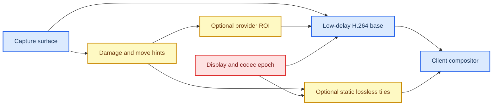

# Codec and desktop-compression red-team research

_LatencyDesk Architecture Research Sprint · Agent D · 2026-08-13 · Scope: Windows↔Linux interactive desktop video and refinement_

---

## Executive answers

1. **v0.1 best codec:** capability-negotiated hardware **H.264/AVC, 8-bit 4:2:0**, as the mandatory interoperable video floor—not because it is the best desktop codec, but because the collected vendor evidence spans the proposed providers more convincingly than HEVC or AV1. NVIDIA documents H.264 across its listed NVENC generations; Intel’s documented 11th/12th-generation matrix exposes AVC 8-bit 4:2:0 plus I/P, low-delay rate control, ROI, and intra refresh; AMD exposes a low-latency AVC encoder API. [NVIDIA NVENC capability matrix](https://docs.nvidia.com/video-technologies/video-codec-sdk/13.0/nvenc-application-note/index.html) · [Intel oneVPL feature matrix](https://www.intel.com/content/www/us/en/docs/onevpl/developer-reference-media-intel-hardware/1-0/features-and-formats.html) · [AMD AMF AVC API](https://raw.githubusercontent.com/GPUOpen-LibrariesAndSDKs/AMF/master/amf/public/include/components/VideoEncoderVCE.h)
2. **Why:** it is the only candidate here with direct vendor evidence for a low-delay, hardware-encoded 4:2:0 path across NVIDIA, Intel integrated graphics, and AMD’s long-running AMF family. That evidence is still vendor-, driver-, and generation-specific; it is not a market-coverage guarantee. The product must negotiate both endpoints’ actual encode *and decode* capability rather than infer it from codec names.
3. **AV1 in v0.1:** no mandatory AV1 path. AV1 is worth a controlled optional prototype only when both endpoints expose hardware encode/decode and its output improves the target desktop benchmark at the same latency. NVIDIA lists AV1 encode only from Ada in its matrix, and Intel’s cited hardware matrix lists AV1 encode for Arc A-Series, not 11th/12th-generation integrated graphics. [NVIDIA matrix](https://docs.nvidia.com/video-technologies/video-codec-sdk/13.0/nvenc-application-note/index.html) · [Intel matrix](https://www.intel.com/content/www/us/en/docs/onevpl/developer-reference-media-intel-hardware/1-0/features-and-formats.html)
4. **4:4:4 in v0.1:** no full-frame 4:4:4 requirement. It is technically valuable for colored text, but provider support is asymmetric: the cited Intel 11th/12th AVC rows advertise only NV12 4:2:0 while their HEVC rows advertise 4:4:4; NVIDIA lists H.264 4:4:4 but only CAVLC. This is too narrow for the mandatory route. [Intel matrix](https://www.intel.com/content/www/us/en/docs/onevpl/developer-reference-media-intel-hardware/1-0/features-and-formats.html) · [NVIDIA matrix](https://docs.nvidia.com/video-technologies/video-codec-sdk/13.0/nvenc-application-note/index.html)
5. **Does ROI replace a custom hybrid codec?** no. ROI is a per-block QP/priority hint inside one lossy access unit; it neither yields exact pixels nor separate delivery, recovery, cache, or composition semantics. [VA-API ROI contract](https://raw.githubusercontent.com/intel/libva/master/va/va.h) · [oneVPL ROI contract](https://oneapi-spec.uxlfoundation.org/specifications/oneapi/v1.2-rev-1/elements/onevpl/source/api_ref/vpl_structs_encode) · [NVENC emphasis map](https://docs.nvidia.com/video-technologies/video-codec-sdk/13.1/nvenc-video-encoder-api-prog-guide/index.html)
6. **Static refinement versus region hybrid:** a sparse, independently discardable static-lossless tile overlay is more practical than concurrent per-region video encoders. It can be composed over a complete video base and dropped harmlessly; it still requires explicit epoch, rectangle, and invalidation rules. This is not evidence that it improves bandwidth or text clarity on the target machines: **EXPERIMENT_REQUIRED**.
7. **Closest route to low latency + low bandwidth + sharp text:** low-delay H.264 4:2:0 base video, provider-supported ROI/dirty-region hints, and optional static lossless RGB/RGBA refinement tiles for settled text/UI. This avoids making the least portable capability—full-frame 4:4:4—the baseline, while providing an exact-pixel path where 4:2:0 visibly loses chroma detail. The claimed combined outcome is **EXPERIMENT_REQUIRED** until optical latency, byte rate, and text-crop measurements exist.

> **Red-team conclusion:** “H.264 first; Hybrid Codec later” is safe only if “first” means a narrow video interoperability floor, not an excuse to defer all desktop-aware semantics. Retain the H.264 floor, but define damage/ROI capability reporting and safe refinement invalidation now. Reject simultaneous region video encoders for v0.1; do not assume ROI makes an exact refinement channel unnecessary.

## Evidence limits and comparison frame

This review uses standards, OS documentation, vendor programming guides, and upstream API headers. It deliberately does **not** convert codec-generation tables into a claim of universal hardware support or end-to-end latency. NVIDIA’s tables are SDK- and GPU-generation-specific; Intel’s cited grid is a published oneVPL hardware matrix; VA-API deliberately exposes driver queries because the API is not the driver; AMF availability depends on installed runtime/driver and queried component properties. [NVENC programming guide](https://docs.nvidia.com/video-technologies/video-codec-sdk/13.1/nvenc-video-encoder-api-prog-guide/index.html) · [oneVPL `MFXVideoENCODE_Query`](https://oneapi-spec.uxlfoundation.org/specifications/oneapi/v1.2-rev-1/elements/onevpl/source/api_ref/vpl_func_vid_encode) · [libva API](https://raw.githubusercontent.com/intel/libva/master/va/va.h) · [AMF README](https://github.com/GPUOpen-LibrariesAndSDKs/AMF)

No compositor-specific codec claim is made here. PipeWire surface format, DMA-BUF import, explicit synchronization, and cross-adapter copies remain compositor-, driver-, and device-specific preconditions to any encoder result. A successful codec negotiation therefore does not prove a zero-copy capture-to-encode path.

| Candidate | What the primary evidence establishes | Desktop-specific opportunity | v0.1 fit | Principal constraint |
|---|---|---|---|---|
| H.264/AVC | NVIDIA, Intel 11th/12th Gen, and AMF all document hardware/low-latency AVC interfaces. [NVIDIA](https://docs.nvidia.com/video-technologies/video-codec-sdk/13.0/nvenc-application-note/index.html) · [Intel](https://www.intel.com/content/www/us/en/docs/onevpl/developer-reference-media-intel-hardware/1-0/features-and-formats.html) · [AMF AVC](https://raw.githubusercontent.com/GPUOpen-LibrariesAndSDKs/AMF/master/amf/public/include/components/VideoEncoderVCE.h) | Low-delay P, cyclic intra refresh, ROI on some providers | Mandatory base | 4:2:0 loses chroma detail; H.264 4:4:4 is not a common hardware contract |
| HEVC/H.265 | Intel’s listed 11th/12th rows include 4:4:4 and Screen Content Coding; NVIDIA lists 4:4:4 from Pascal in the cited table. [Intel](https://www.intel.com/content/www/us/en/docs/onevpl/developer-reference-media-intel-hardware/1-0/features-and-formats.html) · [NVIDIA](https://docs.nvidia.com/video-technologies/video-codec-sdk/13.0/nvenc-application-note/index.html) | SCC and 4:4:4 can be attractive for desktop images | Capability-gated later provider | Encoder/decoder interoperability and patent/distribution review are not cleared by the API |
| AV1 | The AV1 specification includes palette mode and intra-block copy; its profile table permits 4:4:4, but cited NVIDIA and Intel hardware encode matrices list only newer, 4:2:0-focused implementations. [AV1 spec](https://aomediacodec.github.io/av1-spec/) · [NVIDIA](https://docs.nvidia.com/video-technologies/video-codec-sdk/13.0/nvenc-application-note/index.html) · [Intel](https://www.intel.com/content/www/us/en/docs/onevpl/developer-reference-media-intel-hardware/1-0/features-and-formats.html) | Standard screen-content tools, tiles, segmentation, and reference flexibility | Optional experiment only | Hardware encode support is too generation-concentrated for a mandatory Windows↔Linux v0.1 route |

The AV1 standard allows intra-block copy only in intra frames and disables loop filtering in that mode; it is therefore not a drop-in substitute for a continuously inter-coded, low-delay desktop stream. [AV1 bitstream specification](https://aomediacodec.github.io/av1-spec/)

## Decision 1 — mandatory v0.1 video codec

Decision:
Use hardware H.264/AVC 8-bit 4:2:0 as the mandatory video baseline, with profile/level and encoder/decoder capability negotiated at session setup.

Current proposal:
Full-frame low-delay H.264 8-bit 4:2:0 is the first reference path; newer codecs are later optional providers.

Verdict: MODIFY

Recommended solution:
Keep H.264 as the only mandatory v0.1 video codec, but change the decision text from “H.264 is the desktop answer” to “H.264 is the compatibility floor.” Require every selected route to report its actual encode and decode capability, input format, queue depth, reference/recovery controls, and whether it is hardware-accelerated. Do not silently select a software path that changes the latency contract.

Why:
NVIDIA documents H.264 across its listed NVENC generations, while AV1 starts at Ada in that table. Intel documents AVC 4:2:0 encode on 11th/12th-generation hardware and AV1 encode only on Arc in the cited matrix. AMD’s AMF exposes low-latency AVC controls and supports DirectX/OpenGL/OpenCL-oriented integration, subject to its runtime and driver. This is the strongest direct evidence for a common low-delay hardware baseline, but it proves neither a particular client decoder nor a target latency measurement. [NVIDIA matrix](https://docs.nvidia.com/video-technologies/video-codec-sdk/13.0/nvenc-application-note/index.html) · [Intel matrix](https://www.intel.com/content/www/us/en/docs/onevpl/developer-reference-media-intel-hardware/1-0/features-and-formats.html) · [AMF README](https://github.com/GPUOpen-LibrariesAndSDKs/AMF) · [AMF AVC API](https://raw.githubusercontent.com/GPUOpen-LibrariesAndSDKs/AMF/master/amf/public/include/components/VideoEncoderVCE.h)

Alternative:
Make HEVC the mandatory baseline for its available Screen Content Coding and 4:4:4 routes, or make AV1 mandatory for its screen-content tools.

Risk:
Either alternative narrows the first runnable cross-platform set before real hardware/driver validation. Keeping H.264 risks visibly weaker colored-text quality at constrained bitrates; it must not be marketed as a desktop-specialized codec.

Prototype required:
EXPERIMENT_REQUIRED — establish a host/client capability matrix on the actual supported Windows and Linux devices, including hardware decode, before treating H.264 compatibility as a release claim.

Evidence:
[NVIDIA NVENC Application Note](https://docs.nvidia.com/video-technologies/video-codec-sdk/13.0/nvenc-application-note/index.html) documents generation-specific H.264/HEVC/AV1 capabilities; [Intel’s oneVPL matrix](https://www.intel.com/content/www/us/en/docs/onevpl/developer-reference-media-intel-hardware/1-0/features-and-formats.html) documents 11th/12th Gen AVC and Arc AV1 rows; [oneVPL’s query contract](https://oneapi-spec.uxlfoundation.org/specifications/oneapi/v1.2-rev-1/elements/onevpl/source/api_ref/vpl_func_vid_encode) makes capability querying mandatory.

## Decision 2 — AV1 and HEVC admission

Decision:
Do not ship AV1 as a mandatory v0.1 codec; keep HEVC and AV1 as capability-gated experimental providers rather than implied upgrades.

Current proposal:
HEVC and AV1 are optional later providers that must not delay the H.264 baseline.

Verdict: KEEP

Recommended solution:
Keep both out of the mandatory v0.1 matrix. Prototype AV1 first only on a deliberately narrow pair where both endpoints have verified hardware support; consider HEVC as a separate opt-in experiment when its screen-content/4:4:4 advantages, decoder availability, and distribution analysis are all acceptable. A codec selection must include both endpoints’ hardware decode as well as host encode support.

Why:
AV1’s standard has palette mode, intra-block copy, tiles, segmentation, and profiles that include 4:4:4; that is a real desktop-oriented opportunity. Yet NVIDIA’s cited AV1 encoder table begins at Ada/Blackwell and specifies 4:2:0 8/10-bit, while Intel’s cited AV1 encode row is Arc A-Series 4:2:0. Intel’s same table documents HEVC Screen Content Coding and 4:4:4 on 11th/12th generation, so HEVC may be the earlier high-fidelity experiment—but it is not evidence of universal endpoint decode or a legal distribution clearance. [AV1 spec](https://aomediacodec.github.io/av1-spec/) · [NVIDIA matrix](https://docs.nvidia.com/video-technologies/video-codec-sdk/13.0/nvenc-application-note/index.html) · [Intel matrix](https://www.intel.com/content/www/us/en/docs/onevpl/developer-reference-media-intel-hardware/1-0/features-and-formats.html)

Alternative:
Ship AV1 as an early access v0.1 route and fall back to H.264 whenever either endpoint lacks it.

Risk:
An early access route can multiply encoder, decoder, packetization, recovery, test, and support combinations without proving a user-visible advantage. Conversely, omitting AV1 may leave bandwidth savings and screen-content tooling unrealized on modern hardware.

Prototype required:
EXPERIMENT_REQUIRED — compare hardware AV1 4:2:0 against H.264 4:2:0 at identical resolution, frame-rate cap, network profile, and end-to-end latency budget on actual supported pairs.

Evidence:
[The AOM AV1 specification](https://aomediacodec.github.io/av1-spec/) defines palette/intra-block-copy and profile chroma rules; [NVIDIA’s capability table](https://docs.nvidia.com/video-technologies/video-codec-sdk/13.0/nvenc-application-note/index.html) and [Intel’s hardware table](https://www.intel.com/content/www/us/en/docs/onevpl/developer-reference-media-intel-hardware/1-0/features-and-formats.html) bound the documented hardware encode availability.

## Decision 3 — 4:2:0 versus 4:4:4

Decision:
Keep full-frame 8-bit 4:2:0 as the mandatory v0.1 base; do not require full-frame 4:4:4, and reserve exact static tile refinement for cases where chroma fidelity matters.

Current proposal:
The H.264 baseline is 8-bit 4:2:0, with desktop refinement deferred.

Verdict: MODIFY

Recommended solution:
Keep 4:2:0 for the common video path, but explicitly classify full-frame 4:4:4 as an opt-in endpoint pair capability, not a presumed quality setting. Define the future refinement path as RGB/RGBA exact tiles over the 4:2:0 base rather than promising a universal 4:4:4 video route.

Why:
The AV1 standard distinguishes 4:2:0 and 4:4:4 at the bitstream profile level. NVIDIA lists H.264 4:4:4 on its matrix but qualifies it as CAVLC-only; Intel’s 11th/12th-generation AVC rows list NV12 4:2:0 whereas their HEVC rows list AYUV/Y410 4:4:4 and SCC. Therefore the evidence does not support a cross-vendor mandatory H.264 4:4:4 contract. [AV1 chroma profile table](https://aomediacodec.github.io/av1-spec/) · [NVIDIA matrix](https://docs.nvidia.com/video-technologies/video-codec-sdk/13.0/nvenc-application-note/index.html) · [Intel matrix](https://www.intel.com/content/www/us/en/docs/onevpl/developer-reference-media-intel-hardware/1-0/features-and-formats.html)

Alternative:
Require HEVC 4:4:4 or H.264 4:4:4 for text-heavy sessions.

Risk:
The alternative can force a codec/chroma conversion, reject otherwise capable endpoints, and create decoder/driver support failures. The recommended 4:2:0 base can still blur colored text until a refinement mechanism is available.

Prototype required:
EXPERIMENT_REQUIRED — measure whether full-frame 4:4:4, compared with 4:2:0 plus static exact tiles, improves target text crops enough to justify the compatibility loss and any conversion/copy cost.

Evidence:
[AV1’s standard chroma table](https://aomediacodec.github.io/av1-spec/) defines permitted 4:2:0/4:4:4 profiles; [NVIDIA’s matrix](https://docs.nvidia.com/video-technologies/video-codec-sdk/13.0/nvenc-application-note/index.html) identifies H.264 4:4:4 as CAVLC-only; [Intel’s matrix](https://www.intel.com/content/www/us/en/docs/onevpl/developer-reference-media-intel-hardware/1-0/features-and-formats.html) makes the 11th/12th-generation distinction explicit.

## Decision 4 — low-delay coding, references, and recovery

Decision:
Use a P-only, no-lookahead, single-pass low-delay base configuration initially; force an IDR-equivalent independently decodable point for join, reconfiguration, and confirmed dependency failure. Treat rolling intra refresh and LTR as optional provider features, not universal recovery points.

Current proposal:
No B-frames, no lookahead, bounded rate-control buffer, low-delay references, and recovery on join/reconfiguration/continuity failure with IDR or intra refresh according to provider capability.

Verdict: MODIFY

Recommended solution:
Specify one short-term reference as the initial conservative target, with no conventional B-frame reordering and no lookahead. Carry conservative dependency metadata for every P access unit. Permit an IDR only where the receiver can safely reset; permit intra refresh only when the provider exposes it and the implementation has experimentally proved the point at which the receiver may resume after a loss. Keep LTR behind a provider capability because feedback/invalidation semantics are encoder-specific. Do not mark the first frame in a rolling refresh as independently decodable merely because an API exposed “intra refresh.”

Why:
NVENC documents that lookahead queues frames until sufficient input arrives, and recommends very-low VBV, CBR, no/restricted B-frame use, long GOP, intra refresh, LTR, and force-IDR options for low-latency cases. Its intra refresh encodes sections over consecutive frames, applies in encode order, and is slice-based for H.264/HEVC and tile-based for AV1; that describes a recovery wave, not an automatically universal one-frame reset boundary. oneVPL likewise describes intra refresh as encoding part of each frame during a refresh cycle and separately offers Recovery Point SEI. [NVENC guide: lookahead](https://docs.nvidia.com/video-technologies/video-codec-sdk/13.1/nvenc-video-encoder-api-prog-guide/index.html) · [NVENC guide: error resilience](https://docs.nvidia.com/video-technologies/video-codec-sdk/13.1/nvenc-video-encoder-api-prog-guide/index.html) · [oneVPL coding options](https://oneapi-spec.uxlfoundation.org/specifications/oneapi/v1.2-rev-1/elements/onevpl/source/api_ref/vpl_structs_encode)

Alternative:
Use NVIDIA unidirectional B-frames, which NVIDIA says use past references only and avoid conventional B-frame latency, or use multi-reference/LTR aggressively for compression.

Risk:
P-only and one short-term reference can consume more bandwidth. IDRs can create burst pressure. Aggressive references, B modes, or an incorrectly declared intra-refresh recovery point can make frame drops or loss recovery unsafe.

Prototype required:
EXPERIMENT_REQUIRED — validate, per provider/driver/decoder pair, exactly when loss recovery following rolling intra refresh is visually and dependency-safe; separately compare P-only with NVIDIA unidirectional B on NVIDIA-only pairs.

Evidence:
[NVENC low-latency and error-resilience documentation](https://docs.nvidia.com/video-technologies/video-codec-sdk/13.1/nvenc-video-encoder-api-prog-guide/index.html) documents lookahead buffering, LTR, intra refresh, and unidirectional B-frames; [oneVPL](https://oneapi-spec.uxlfoundation.org/specifications/oneapi/v1.2-rev-1/elements/onevpl/source/api_ref/vpl_structs_encode) documents intra-refresh cycles and Recovery Point SEI.

## Decision 5 — ROI, damage metadata, and desktop deltas

Decision:
Use capture damage/move metadata and provider ROI as optional quality/efficiency hints; do not represent either as a correctness-preserving desktop delta stream or as a replacement for independently verifiable refinement.

Current proposal:
A future hybrid desktop codec may use desktop-aware updates; the current H.264 path is full-frame.

Verdict: MODIFY

Recommended solution:
Pass a normalized, optional damage/priority description from capture to encoder where the provider supports it. A provider that lacks the feature must remain correct with no hint. Treat every ROI as only a QP/priority request within the normal full-frame access unit. Use dirty rectangles to nominate invalidated/refinable tiles, never to assert that omitted pixels can be reconstructed by an unreliable client.

Why:
VA-API says its ROI input adjusts macroblock QPs and exposes both ROI and dirty-rectangle support as driver-queryable attributes; its dirty-rectangle description says unchanged regions are *assumed* unchanged so the encoder may optimize. oneVPL exposes ROI rectangles aligned/expanded to codec block boundaries and lets applications send dirty rectangles. NVENC’s emphasis map is macroblock-level QP adjustment, and AMF’s H.264/HEVC ROI data is an importance map over 16×16/64×64 blocks. None supplies independent exact-pixel delivery or cache invalidation semantics. [VA-API ROI/dirty-rectangle API](https://raw.githubusercontent.com/intel/libva/master/va/va.h) · [oneVPL ROI/dirty rectangle API](https://oneapi-spec.uxlfoundation.org/specifications/oneapi/v1.2-rev-1/elements/onevpl/source/api_ref/vpl_structs_encode) · [NVENC emphasis map](https://docs.nvidia.com/video-technologies/video-codec-sdk/13.1/nvenc-video-encoder-api-prog-guide/index.html) · [AMF AVC API](https://raw.githubusercontent.com/GPUOpen-LibrariesAndSDKs/AMF/master/amf/public/include/components/VideoEncoderVCE.h) · [AMF HEVC API](https://raw.githubusercontent.com/GPUOpen-LibrariesAndSDKs/AMF/master/amf/public/include/components/VideoEncoderHEVC.h)

Alternative:
Use DXGI dirty/move data as the primary network delta protocol and skip full-frame video whenever only a small area changed.

Risk:
Microsoft says dirty/move rectangles are coalesced when the OS cannot retain precise updates, and client reconstruction must process moves before dirty rectangles while retaining the complete previous image. Losing a network delta would therefore need its own reliable state, checkpoints, and recovery design; this is materially different from an encoder hint. [Microsoft Desktop Duplication API](https://learn.microsoft.com/en-us/windows/win32/direct3ddxgi/desktop-dup-api)

Prototype required:
EXPERIMENT_REQUIRED — determine whether per-frame ROI fed from real capture damage improves text quality or byte rate at fixed end-to-end latency on each provider, rather than assuming the hint survives rate control beneficially.

Evidence:
[Microsoft’s Desktop Duplication documentation](https://learn.microsoft.com/en-us/windows/win32/direct3ddxgi/desktop-dup-api) defines dirty/move semantics and coalescing; [VA-API](https://raw.githubusercontent.com/intel/libva/master/va/va.h), [oneVPL](https://oneapi-spec.uxlfoundation.org/specifications/oneapi/v1.2-rev-1/elements/onevpl/source/api_ref/vpl_structs_encode), [NVENC](https://docs.nvidia.com/video-technologies/video-codec-sdk/13.1/nvenc-video-encoder-api-prog-guide/index.html), and [AMF](https://raw.githubusercontent.com/GPUOpen-LibrariesAndSDKs/AMF/master/amf/public/include/components/VideoEncoderVCE.h) define QP/importance rather than a separate exact-pixel wire protocol.

## Decision 6 — static lossless refinement versus region hybrid codecs

Decision:
Prefer a sparse static-lossless tile overlay over multiple simultaneous region video encoders; design its invalidation contract now, but do not ship it until a benchmark establishes net value.

Current proposal:
Build a complete full-frame H.264 baseline first, then add independently discardable exact tiles and static refinements; do not run several region encoders at once in v0.1.

Verdict: MODIFY

Recommended solution:
Retain the prohibition on simultaneous region encoders. Narrow the later mechanism to independently compressed lossless RGB/RGBA tiles that are composited over the current video base only when all of these match: display identity, `codec_epoch`, rectangle, source-generation, and tile version/hash. A resize, mode change, move, or dirty intersection must invalidate any affected tile before it can be shown over a newer base. Loss of a tile must leave only the lossy base visible, never a corrupt composition.

Why:
This approach gives a simple correctness boundary: the video stream remains the complete fallback image; refinements are optional overlays. By contrast, per-region codecs need concurrent rate allocation, timestamping, z-order, decoder lifetime, region boundaries, loss recovery, and attribution. The OS capture API offers move/dirty information useful for tile invalidation, but its coalescing behavior means over-invalidation is required for safety. [Microsoft Desktop Duplication API](https://learn.microsoft.com/en-us/windows/win32/direct3ddxgi/desktop-dup-api)

Alternative:
Run a full-frame video codec plus live HEVC/AV1/H.264 region streams, potentially using different chroma formats or codec choices.

Risk:
Static tiles can cost CPU/GPU copies and can thrash during scrolling, animation, cursor-over-text, or frequent UI changes. Region hybrid can theoretically adapt more aggressively but creates a materially larger synchronization and loss surface. Whether static refinement wins on bytes or clarity is **EXPERIMENT_REQUIRED**.

Prototype required:
EXPERIMENT_REQUIRED — establish whether an independently discardable, lossless tile overlay improves text clarity or total delivered bytes without raising p95 input-to-photon latency on IDE, terminal, and browser workloads.

Evidence:
[Microsoft’s Desktop Duplication API](https://learn.microsoft.com/en-us/windows/win32/direct3ddxgi/desktop-dup-api) establishes that move operations precede dirty updates and that dirty metadata can be coalesced; [the AV1 specification](https://aomediacodec.github.io/av1-spec/) shows that even standard codec tools such as intra-block copy are frame-constrained rather than a ready-made independently composable desktop tile protocol.

## Decision 7 — provider and distribution contract

Decision:
Treat NVENC, VA-API, oneVPL/QSV, and AMF as independently capability-negotiated providers with no brand-based assumptions; bind codec distribution review to each binary/provider route.

Current proposal:
NVENC is the reference hardware path, with Media Foundation/Intel/AMD, VA-API/oneVPL, and AMF later where permitted.

Verdict: MODIFY

Recommended solution:
Make provider selection a two-endpoint admission test. For each selected encoder/decoder pair, record: codec/profile/level; chroma and bit-depth; input memory domain; hardware versus partial/software acceleration; P/B/lookahead and maximum reference behavior; IDR/intra-refresh/LTR controls; ROI/dirty support; input/output queue policy; reconfigure behavior; and the exact runtime/driver version. Reject a selection that cannot report a bounded low-delay configuration instead of treating a nominal codec name as sufficient.

Why:
NVENC explicitly requires applications to enumerate codec GUIDs, input formats, and feature capabilities, and exposes Windows/Linux driver libraries. oneVPL makes `MFXVideoENCODE_Query` mandatory and can report partial acceleration. VA-API defines per-driver profile/entrypoint/config queries plus capability attributes for ROI, intra refresh, reference count, and rate control. AMF exposes low-latency presets, rate-control/VBV, reference/IDR/intra-refresh/ROI controls, but its AV1 header also shows a default input queue size of 16—an example of why queue behavior must be selected and measured rather than inherited. [NVENC guide](https://docs.nvidia.com/video-technologies/video-codec-sdk/13.1/nvenc-video-encoder-api-prog-guide/index.html) · [oneVPL query](https://oneapi-spec.uxlfoundation.org/specifications/oneapi/v1.2-rev-1/elements/onevpl/source/api_ref/vpl_func_vid_encode) · [VA-API](https://raw.githubusercontent.com/intel/libva/master/va/va.h) · [AMF AV1 API](https://raw.githubusercontent.com/GPUOpen-LibrariesAndSDKs/AMF/master/amf/public/include/components/VideoEncoderAV1.h)

Alternative:
Expose a single generic “H.264 hardware encoder” configuration and rely on provider defaults.

Risk:
Defaults can include queueing, lookahead, B-frame structures, or unsupported features that violate the latency/recovery model. Legal risk is separate: AMD’s AMF H.264 header states that AMD does not grant a standards-IP sublicense; AVC and HEVC pool programs publish separate licensing arrangements, while the AOM patent license is royalty-free only for its covered necessary claims and under its terms. [AMF legal notice](https://raw.githubusercontent.com/GPUOpen-LibrariesAndSDKs/AMF/master/amf/public/include/components/VideoEncoderVCE.h) · [Via LA AVC/H.264 program](https://via-la.com/licensing-programs/avc-h-264/) · [Access Advance HEVC program](https://accessadvance.com/licensing-programs/hevc-advance/) · [AOM patent license](https://aomedia.org/license/patent-license/)

Prototype required:
EXPERIMENT_REQUIRED — build a runtime capability probe that validates the selected configuration actually initializes and produces bounded-delay output on each supported driver, then submit its binary-distribution route for legal review before release.

Evidence:
[NVENC’s programming guide](https://docs.nvidia.com/video-technologies/video-codec-sdk/13.1/nvenc-video-encoder-api-prog-guide/index.html), [oneVPL’s mandatory query documentation](https://oneapi-spec.uxlfoundation.org/specifications/oneapi/v1.2-rev-1/elements/onevpl/source/api_ref/vpl_func_vid_encode), [libva’s capability attributes](https://raw.githubusercontent.com/intel/libva/master/va/va.h), and [AMF’s source headers](https://github.com/GPUOpen-LibrariesAndSDKs/AMF) all require capability/driver-aware handling rather than codec-name inference.

## Practical implementation boundary

The recommended near-term boundary is deliberately smaller than a desktop-specific codec:

This does **not** assert that lossless tiles are a v0.1 feature. It fixes the crucial distinction that allows future work to be independently evaluated: ROI changes a base stream’s quality allocation; tile refinement changes what can be shown exactly; desktop deltas require client-state correctness and recovery.

## Candidate experiments

- Does P-only H.264 without lookahead meet the target p95 end-to-end latency on every proposed v0.1 host/client hardware pair?
- Does damage-driven ROI improve text-crop quality at a fixed delivered bitrate and latency budget on each provider?
- Does a static lossless tile overlay improve text clarity without increasing p95 input-to-photon latency on IDE, terminal, and browser workloads?
- Does 4:2:0 plus static exact tiles beat full-frame 4:4:4 on total bytes and compatibility at equal text quality?
- Does hardware AV1 reduce delivered bytes at equal text-crop quality and p95 latency versus H.264 on an Ada/Arc-capable endpoint pair?
- Does rolling intra refresh provide a decoder-safe recovery boundary sooner than forced IDR after a simulated lost reference frame?
- Do NVIDIA unidirectional B-frames improve delivered bytes without worsening p95 latency or dependency recovery relative to P-only?

## Sources

### Official

- [Microsoft — Desktop Duplication API](https://learn.microsoft.com/en-us/windows/win32/direct3ddxgi/desktop-dup-api)
- [NVIDIA — NVENC Video Encoder API Programming Guide, SDK 13.1](https://docs.nvidia.com/video-technologies/video-codec-sdk/13.1/nvenc-video-encoder-api-prog-guide/index.html)
- [NVIDIA — NVENC Application Note, SDK 13.0](https://docs.nvidia.com/video-technologies/video-codec-sdk/13.0/nvenc-application-note/index.html)
- [Intel — oneVPL Media Capabilities Supported by Intel Hardware, v1.1](https://www.intel.com/content/www/us/en/docs/onevpl/developer-reference-media-intel-hardware/1-0/features-and-formats.html)

### Upstream

- [oneAPI — oneVPL `MFXVideoENCODE_Query`](https://oneapi-spec.uxlfoundation.org/specifications/oneapi/v1.2-rev-1/elements/onevpl/source/api_ref/vpl_func_vid_encode)
- [oneAPI — oneVPL Encode Structures](https://oneapi-spec.uxlfoundation.org/specifications/oneapi/v1.2-rev-1/elements/onevpl/source/api_ref/vpl_structs_encode)
- [Intel libva — VA-API core/encoder capability header](https://raw.githubusercontent.com/intel/libva/master/va/va.h)
- [AMD — Advanced Media Framework repository and runtime notes](https://github.com/GPUOpen-LibrariesAndSDKs/AMF)
- [AMD AMF — AVC encoder interface](https://raw.githubusercontent.com/GPUOpen-LibrariesAndSDKs/AMF/master/amf/public/include/components/VideoEncoderVCE.h)
- [AMD AMF — HEVC encoder interface](https://raw.githubusercontent.com/GPUOpen-LibrariesAndSDKs/AMF/master/amf/public/include/components/VideoEncoderHEVC.h)
- [AMD AMF — AV1 encoder interface](https://raw.githubusercontent.com/GPUOpen-LibrariesAndSDKs/AMF/master/amf/public/include/components/VideoEncoderAV1.h)

### Standards

- [ITU-T — H.264 Advanced video coding for generic audiovisual services](https://www.itu.int/rec/T-REC-H.264/en)
- [Alliance for Open Media — AV1 Bitstream and Decoding Process Specification](https://aomediacodec.github.io/av1-spec/)
- [Alliance for Open Media — Patent License 1.0](https://aomedia.org/license/patent-license/)
- [VESA — Display Compression Codecs](https://vesa.org/vesa-display-compression-codecs/)

### Other

- [Via Licensing Alliance — AVC/H.264 Patent Portfolio License](https://via-la.com/licensing-programs/avc-h-264/)
- [Access Advance — HEVC Advance licensing program](https://accessadvance.com/licensing-programs/hevc-advance/)
