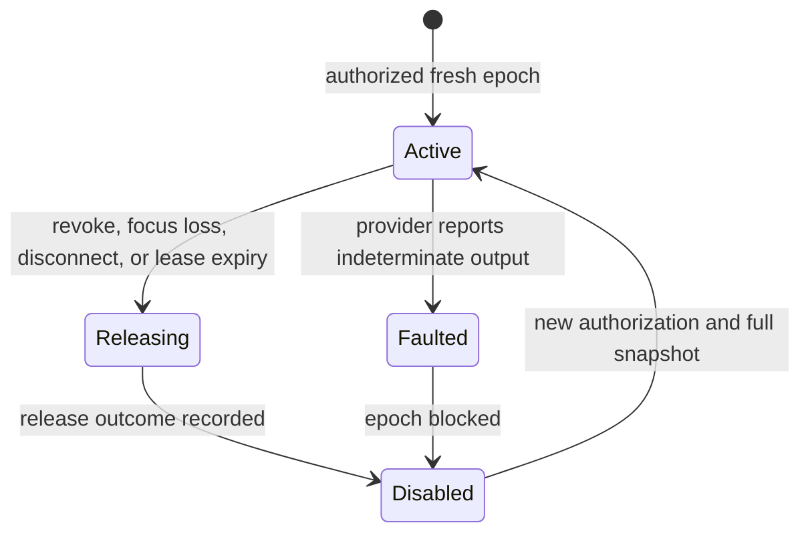

# Agent F — Input control and transport semantics

_Architecture Research Sprint for LatencyDesk — 2026-08-13. This report challenges the proposed “input datagrams plus periodic snapshots” design against platform input boundaries and QUIC’s actual delivery semantics._

---

## Scope and conclusion

The current baseline is feasible for a logged-in, user-authorized desktop session, but **not** if every input event is put on unreliable QUIC DATAGRAMs. A snapshot can repair a missed held state; it cannot reconstruct a short press/release pair that was wholly lost. That makes a pure-datagram input plane semantically wrong for keyboard keys, mouse buttons, wheel steps, and drag boundaries.

Use a reliable, ordered input-transition stream for state-changing edges, a separate reliable control stream for revocation and acknowledgements, and an optional latest-wins DATAGRAM lane only for coalescible **absolute** pointer motion. Do not promise generic remote gaming / raw-relative control in v0.1. Windows `SendInput` is a normal-user-desktop injector subject to UIPI; Raw Input is an observation/capture API, not an injection replacement. On Linux Wayland, the user-authorized `RemoteDesktop` portal plus EIS/libei is the portable route; `/dev/uinput` is a privileged kernel virtual-device route, not a portal fallback.

## Direct answers

1. **Keyboard/mouse transport semantics:** Key down/up, button down/up, wheel ticks, drag start/end, and `release_all` are discrete ordered transitions and must use one reliable ordered input stream. Absolute pointer motion is a sampled target state and may use a sequence-numbered, latest-wins DATAGRAM only when negotiated. In a click/drag edge record, carry an absolute pointer anchor so a delayed or lost motion packet cannot place the edge at a stale coordinate.
2. **Need for unreliable datagrams:** No, they are not required for correct input. They are an optional latency optimization for coalescible absolute motion after both peers negotiate QUIC DATAGRAM support. RFC 9221 explicitly makes DATAGRAM delivery unreliable and permits sender/receiver dropping, while QUIC streams deliver ordered bytes; this excludes DATAGRAMs for state-changing edges. [RFC 9221 §4–5](https://www.rfc-editor.org/rfc/rfc9221.html#section-4) [RFC 9000 §2.2](https://www.rfc-editor.org/rfc/rfc9000.html#section-2.2)
3. **State-reconciliation design:** Keep one authoritative desired state per `(input_epoch, controller_id)`. Send transition records and full snapshots on the *same* reliable ordered stream; each snapshot follows and names its last covered transition sequence. The host compares the snapshot with its own successfully injected state, releases surplus keys/buttons first, then presses missing state only when the epoch is live. Motion datagrams carry a separate sequence and are ignored when stale; the next stream snapshot corrects their absolute cursor state.
4. **How to fully prevent stuck keys:** Do not make that promise. A protocol cannot force a release after the OS has denied/ended injection or after the injector has crashed. It can bound remote-owned state while the provider is alive: reliable edges, periodic full snapshots, a host-monotonic controller lease, `release_all` on every terminal transition, and a fault that disables the epoch if the provider cannot prove a release. `SendInput` itself warns that existing keyboard state can interfere and that a UIPI block is not distinguishable from its return/error values. [SendInput](https://learn.microsoft.com/en-us/windows/win32/api/winuser/nf-winuser-sendinput)
5. **Local cursor design:** In absolute desktop mode, render a client-local cursor immediately in the renderer after video composition; do not wait for host capture or an acknowledgement. Maintain a viewport/display-transform generation, absolute host-logical coordinates, and a latest applied/authoritative position. Hide or exclude a captured host cursor to prevent double cursors; correct the local cursor only from a newer display/input-state acknowledgement. Relative mode has no meaningful absolute cursor and must hide the local cursor while locked.
6. **Relative-mouse/gaming mode:** Make it a separately negotiated experimental capability, disabled by default. Windows `SendInput` relative motion is affected by pointer speed and thresholds, so it is not a raw-count injector. Wayland relative capture and locking depend on compositor-advertised experimental protocols, and libei’s relative values are logical pixels or millimetres according to device type. Lost relative deltas cannot be repaired by a key-state snapshot. [MOUSEINPUT](https://learn.microsoft.com/en-us/windows/win32/api/winuser/ns-winuser-mouseinput) [relative-pointer protocol](https://gitlab.freedesktop.org/wayland/wayland-protocols/-/raw/main/unstable/relative-pointer/relative-pointer-unstable-v1.xml) [libei sender API](https://libinput.pages.freedesktop.org/libei/api/group__libei-sender.html)

## Shared input schema and lifecycle

The following is a semantic schema, not a byte encoding. It deliberately separates identities, state transitions, and replaceable samples.

| Record | Transport | Required fields | Receiver rule |
|---|---|---|---|
| `InputEdge` | One reliable, ordered unidirectional stream | `input_epoch`, `edge_seq`, `device`, `kind`, `physical_key` or `button`, `pressed`, optional `absolute_anchor`, `display_epoch` | Accept exactly once in stream order; inject only in the current authorized epoch |
| `InputSnapshot` | Same stream, after the edges it covers | `input_epoch`, `snapshot_seq`, `after_edge_seq`, full pressed-key set, full button set, absolute pointer state, `display_epoch`, `pointer_mode` | Reconcile against `injected_state`; it is authoritative only after its preceding stream records |
| `AbsoluteMotion` | Optional QUIC DATAGRAM | `input_epoch`, `motion_seq`, `display_epoch`, absolute logical `x,y` | Ignore stale/duplicate sequences; replace an unsent sample with the newest one |
| `InputRevoke` / `ReleaseAll` | Reliable control stream | `input_epoch`, `revoke_seq`, reason | Immediately block the epoch, release every remotely owned input, and acknowledge outcome |
| `InputApplied` / `InputFault` | Reliable control stream | `input_epoch`, last applied edge/snapshot, state digest, provider status | Reports provider-applied state; a fault terminates the epoch rather than guessing success |

`PhysicalKey` is a project-owned, layout-independent position enum with lossless platform mappings; it is not a Windows virtual-key code or a Linux keysym. Windows can inject scan-code keys independently of the active layout, and libei explicitly defines keyboard keycodes as keymap-independent evdev scan codes. Text and IME composition remain a separately negotiated semantic channel, not a translation of physical key records. [KEYBDINPUT](https://learn.microsoft.com/en-us/windows/win32/api/winuser/ns-winuser-keybdinput) [libei sender API](https://libinput.pages.freedesktop.org/libei/api/group__libei-sender.html)

The host’s lease is measured from authenticated arrival on the host’s monotonic clock. It must expire even if no packet arrives, which is the only way to initiate cleanup after a broken network. A snapshot is also a keepalive, so a held key is not released merely because there was no new edge. The controller must start a new epoch after reconnect, portal renewal, or a provider fault; stale records are rejected before they can touch the OS.

## Decisions

### 1. Discrete input transport

Decision: Put all keyboard key edges, mouse-button edges, wheel deltas, and drag boundaries on one reliable ordered input-transition stream; use a DATAGRAM only for negotiated absolute pointer samples.

Current proposal: [The protocol](../../PROTOCOL.md) maps immediate input to QUIC DATAGRAMs with periodic snapshots.

Verdict: MODIFY

Recommended solution: Maintain one framed, reliable ordered input stream per active controller/epoch. Keep a separate `AbsoluteMotion` DATAGRAM lane that is enabled only when both endpoints advertise it; emit a reliable absolute anchor before a button edge and on the final button-up edge.

Why: QUIC requires stream delivery as an ordered byte stream, whereas DATAGRAM frames are explicitly unreliable, can be dropped under receiver pressure, and are not retransmitted after loss. A snapshot can repair the final held state but cannot recreate a quick tap, double click, wheel tick, or intermediate edge whose final state is already “up.” [RFC 9000 §2.2](https://www.rfc-editor.org/rfc/rfc9000.html#section-2.2) [RFC 9221 §4–5](https://www.rfc-editor.org/rfc/rfc9221.html#section-4)

Alternative: Make every input record reliable but coalesce unsent absolute moves in the sender queue. This is correct but cannot discard already queued stream bytes, so it risks stale cursor movement during congestion.

Risk: A lost reliable edge head-of-line-blocks later discrete input. That latency is preferable to reordering a release before its press or silently losing a key. Bounded local queues and controller-lease expiry prevent indefinite host state.

Prototype required: Yes — compare click/key correctness and input-to-applied latency under loss/reorder for all-stream versus stream-plus-absolute-DATAGRAM transport.

Evidence: RFC 9221 says a sender must delay or drop a congestion-blocked DATAGRAM and that receiver processing acknowledgement does not prove application processing; it also recommends application-defined identifiers for logical datagram flows. [RFC 9221 §5.1–5.4](https://www.rfc-editor.org/rfc/rfc9221.html#section-5)

### 2. Reconciliation and sequencing

Decision: Make snapshots ordered, full-state checkpoints in the transition stream; use distinct monotonic sequences for edges, snapshots, and absolute-motion samples.

Current proposal: The baseline carries sequence numbers on immediate events and periodically reconciles pressed keys/buttons plus absolute pointer state.

Verdict: MODIFY

Recommended solution: `edge_seq` advances for every reliable edge; `snapshot_seq` advances for each full checkpoint and includes `after_edge_seq`; `motion_seq` advances independently per device and epoch. A receiver discards stale motion datagrams, processes edge/snapshot frames in stream order, and reconciles only after reading the snapshot’s covered stream prefix. Persist no input state across an epoch change.

Why: A reliable ordered stream already supplies ordering, but explicit sequences make the application’s state audit, deduplication after reconnect, and fault diagnosis unambiguous. DATAGRAMs are connection-level rather than stream-associated, so the application must define its own flow identity and stale-packet policy. [RFC 9000 §2.2](https://www.rfc-editor.org/rfc/rfc9000.html#section-2.2) [RFC 9221 §5.1](https://www.rfc-editor.org/rfc/rfc9221.html#section-5.1)

Alternative: Send snapshots on a second reliable stream with a watermark. This reduces apparent contention but allows the checkpoint to overtake still-useful taps on the transition stream unless the receiver delays reconciliation; it adds complexity without eliminating loss recovery.

Risk: A full pressed-key set has a bounded but nonzero size. Cap the supported key/button universe at capability negotiation, encode it compactly, and reject malformed/oversized sets before allocation.

Prototype required: Yes — property-test duplicate, reordered, delayed, and reconnect traces against the invariant that `injected_state` equals the newest ordered snapshot state after all covered frames apply.

Evidence: The baseline already has an input epoch and monotonic sequence concept; the change is to place state checkpoints in the same ordered history rather than expecting a lossy lane to preserve discrete semantics. [Protocol input messages](../../PROTOCOL.md)

### 3. Stuck-key containment

Decision: Replace any claim of “fully prevent stuck keys” with a conditional bounded-state guarantee and explicit `InputFault` outcome.

Current proposal: The receiver releases all state on focus loss, permission revocation, transport close, or epoch change.

Verdict: MODIFY

Recommended solution: Track only the state the provider has successfully injected for the current epoch. On client control-focus loss, user revoke, portal `Closed`, EIS disconnect, connection close, host lease expiry, epoch rollover, or provider fault: block new records; call provider `release_all(injected_state)` while the provider is callable; record the result; clear ownership; and require a new authorized epoch plus snapshot before another press. On a partial/ambiguous Windows injection result, fault and terminate the epoch rather than infer which members of a batch applied.

Why: `SendInput` does not reset current keyboard state, says already-pressed keys can interfere, and provides no UIPI-specific diagnostic when blocked. A remote protocol cannot deliver a release after the underlying OS endpoint has gone away, so truthful behavior is bounded best-effort cleanup plus visible fault, not absolute prevention. [SendInput](https://learn.microsoft.com/en-us/windows/win32/api/winuser/nf-winuser-sendinput)

Alternative: Depend only on periodic snapshots. This can eventually correct a dropped release during a healthy session but cannot act after both the transport and controller fail.

Risk: Local physical input can coexist with or interfere with injected system input, especially on Windows. Do not use aggregate OS key state as proof that a remote release succeeded; preserve an agent-owned injected-state ledger and expose uncertainty.

Prototype required: Yes — force disconnect, agent restart, portal closure, and denied injection while each modifier and mouse button is held; report whether the provider can demonstrate a release or must surface `InputFault`.

Evidence: Portal sessions can be closed by either side, and a vanished D-Bus client is equivalent to closing its active sessions. The RemoteDesktop specification also says an EIS disconnection requires session closure. [portal Session](https://flatpak.github.io/xdg-desktop-portal/docs/doc-org.freedesktop.portal.Session.html) [RemoteDesktop `ConnectToEIS`](https://flatpak.github.io/xdg-desktop-portal/docs/doc-org.freedesktop.portal.RemoteDesktop.html#org-freedesktop-portal-remotedesktop-connecttoeis)

### 4. Keyboard identity, layouts, and text

Decision: Transport physical key positions for control, retain host-layout resolution, and add no implicit text/IME emulation path.

Current proposal: Immediate records carry a physical key usage; IME/text composition is separate.

Verdict: KEEP

Recommended solution: Preserve the existing split but make the cross-platform position enum normative. Windows maps it to scan code plus extended-key flag where required; Linux EIS/libei maps it to evdev keycodes. Treat a host layout change as a host-side interpretation change, never as a reason to remap a held `PhysicalKey`. Negotiate a distinct reliable text-composition channel only when both providers advertise it; never use it to synthesize password entry or replace physical shortcut semantics.

Why: Windows documents that a virtual-key value can change with layout/other keys while a scan code identifies the same physical key. libei documents its keyboard keycode as an evdev, keymap-independent physical-key equivalent and offers distinct text APIs. [KEYBDINPUT](https://learn.microsoft.com/en-us/windows/win32/api/winuser/ns-winuser-keybdinput) [libei sender API](https://libinput.pages.freedesktop.org/libei/api/group__libei-sender.html)

Alternative: Send Windows virtual keys or X keysyms as the universal wire identifier. This makes same-layout typing appear simpler but fails deterministic physical shortcut behavior across layouts and does not preserve a held key through a layout switch.

Risk: Some host-specific keys and international layouts will require a documented mapping table. Text composition, dead keys, and IME candidate selection remain `EXPERIMENT_REQUIRED` rather than silently approximated.

Prototype required: Yes — change the host layout while a modifier is held and validate key-up, shortcuts, dead-key handling, and explicit text-channel behavior across Windows and target Linux compositors.

Evidence: Windows Unicode injection produces `VK_PACKET`/character-message behavior rather than a physical key sequence, while the portal exposes separate keycode and keysym methods and libei exposes separate physical-key and text APIs. [KEYBDINPUT](https://learn.microsoft.com/en-us/windows/win32/api/winuser/ns-winuser-keybdinput) [RemoteDesktop keyboard methods](https://flatpak.github.io/xdg-desktop-portal/docs/doc-org.freedesktop.portal.RemoteDesktop.html#org-freedesktop-portal-remotedesktop-notifykeyboardkeycode) [libei sender API](https://libinput.pages.freedesktop.org/libei/api/group__libei-sender.html)

### 5. Windows input boundary

Decision: Keep `SendInput` in a per-user interactive-session agent; do not treat Raw Input, Session 0, elevation, or the secure desktop as a fallback injector.

Current proposal: Windows normal input lives in a logged-in per-user agent, while a service owns lifecycle/session discovery.

Verdict: KEEP

Recommended solution: The service may discover/supervise the chosen session but never inject desktop input. The agent advertises `normal_desktop_input` only when it is attached to the selected logged-in interactive session and can inject at the necessary integrity boundary. On Windows desktop/session unavailability, it revokes the current epoch and reports an unavailable capability. Explicitly exclude Ctrl+Alt+Del, logon, lock, and secure-desktop/UAC interaction from v0.1.

Why: Microsoft states that services cannot directly interact with users on supported Windows, recommends a separate GUI process in the interactive user context with secured IPC, and warns against LocalSystem access to the interactive desktop. `SendInput` permits injection only into equal- or lower-integrity applications. [Interactive Services](https://learn.microsoft.com/en-us/windows/win32/services/interactive-services) [SendInput](https://learn.microsoft.com/en-us/windows/win32/api/winuser/nf-winuser-sendinput)

Alternative: Elevate the product or inject from a Session 0 service. This increases attack surface, still does not make Session 0 the selected user desktop, and does not make a normal process a secure-desktop component.

Risk: A medium-integrity agent cannot reliably diagnose UIPI blocking from `SendInput`’s result. A Windows machine’s UAC policy may route elevation to the secure desktop by default, and Winlogon owns separate authentication and application desktops. [UAC settings](https://learn.microsoft.com/en-us/windows/security/application-security/application-control/user-account-control/settings-and-configuration) [Initializing Winlogon](https://learn.microsoft.com/en-us/windows/win32/secauthn/initializing-winlogon)

Prototype required: Yes — establish the exact capability matrix for normal, elevated, locked, UAC, fast-user-switch, and disconnected session conditions on supported Windows editions.

Evidence: Raw Input is expressly a mechanism for applications to register HID devices and receive `WM_INPUT`; it can distinguish devices and handle high-frequency mouse data, but it does not turn a host injector into a device source. Use it only as an optional focused-client capture path, including for relative-motion experiments. [Raw Input overview](https://learn.microsoft.com/en-us/windows/win32/inputdev/about-raw-input)

### 6. Linux Wayland, portal, libei, and uinput

Decision: Use the user-authorized RemoteDesktop portal plus EIS/libei as the only portable Wayland injection backend; reject `/dev/uinput` as a v0.1 fallback.

Current proposal: Linux standard operation uses `RemoteDesktop` portal and libei in a logged-in user session, with uinput/compositor-specific paths deferred.

Verdict: KEEP

Recommended solution: After a portal session starts, inspect the user-selected device bitmask and request `ConnectToEIS`; use only EIS after it is established. On `Session::Closed`, D-Bus loss, EIS disconnect, or permission renewal failure, revoke the input epoch and close local input resources. Advertise exact `keyboard`, `pointer`, `absolute_pointer`, and `relative_pointer` capabilities from the selected portal/EIS/compositor instance — not from distribution branding.

Why: The RemoteDesktop portal explicitly mediates user device selection and can return an EIS file descriptor only after `Start`; after EIS connects, legacy `Notify*` injection calls must fail. A portal session can close independently, and restored permissions can be withdrawn. [RemoteDesktop portal](https://flatpak.github.io/xdg-desktop-portal/docs/doc-org.freedesktop.portal.RemoteDesktop.html) [portal Session](https://flatpak.github.io/xdg-desktop-portal/docs/doc-org.freedesktop.portal.Session.html)

Alternative: Open `/dev/uinput` and create a virtual keyboard/mouse. The kernel interface can create a virtual device and deliver its events to consumers, but it is not an XDG portal grant and has no built-in remote-desktop session lifecycle. Whether a particular compositor accepts or classifies it as an eligible seat device is compositor-specific. [Linux kernel uinput documentation](https://www.kernel.org/doc/html/latest/_sources/input/uinput.rst.txt) [Wayland input model](https://wayland.freedesktop.org/docs/book/Protocol.html#input)

Risk: Portal and compositor support are version- and vendor-specific. The EIS protocol runs between the client and an EIS implementation, typically a compositor, so support must be negotiated rather than assumed. `EXPERIMENT_REQUIRED` for each supported GNOME/KDE version matrix. [EIS overview](https://libinput.pages.freedesktop.org/libei/doc/overview/index.html)

Prototype required: Yes — run the portal flow on each supported compositor and verify allowed devices, EIS availability, session closure, permission revocation/re-prompt, and release behavior.

Evidence: libei’s sender API supports relative/absolute pointer motion, buttons, keyboard keycodes, and grouping into a logical hardware frame, but the EIS implementation creates the device/capability context. [libei sender API](https://libinput.pages.freedesktop.org/libei/api/group__libei-sender.html)

### 7. Local cursor and absolute desktop control

Decision: Use local, predicted cursor rendering only in absolute desktop mode, with reliable edge anchors and display-generation correction.

Current proposal: The client has a native renderer plus local cursor, while protocol capability negotiation includes cursor modes.

Verdict: MODIFY

Recommended solution: Render a `LocalCursor` after the decoded frame using the current remote-view transform. Update it synchronously from local absolute pointer input; stamp outbound records with `display_epoch`; draw the host cursor only for non-controlling viewers or when local cursor mode is unavailable. A host acknowledgement/snapshot with a newer display epoch or applied absolute coordinate is authoritative and corrects the local model. Button records include an anchor coordinate so a click does not depend on prior lossy motion delivery.

Why: Windows absolute injection is normalized and maps to either the primary monitor or full virtual desktop, while the Linux portal defines absolute coordinates in the selected stream’s logical coordinate space. Therefore a local cursor must be tied to a negotiated display/stream transform and reset on resize, rotation, monitor switch, or scale change. [MOUSEINPUT](https://learn.microsoft.com/en-us/windows/win32/api/winuser/ns-winuser-mouseinput) [RemoteDesktop absolute motion](https://flatpak.github.io/xdg-desktop-portal/docs/doc-org.freedesktop.portal.RemoteDesktop.html#org-freedesktop-portal-remotedesktop-notifypointermotionabsolute)

Alternative: Show only a host-captured cursor. This avoids reconciliation logic but adds one capture/encode/decode round trip to visible mouse response and may draw two cursors.

Risk: A local cursor can lie if the host display topology or coordinate transform changes before the client learns it. Treat display metadata as an epoch boundary: hide/disable control until a matching transform is installed.

Prototype required: Yes — resize, change scale/rotation, move across virtual displays, and click at edges while injecting loss/reorder into the absolute-motion lane.

Evidence: The Windows API’s relative path is subject to pointer-speed acceleration; the absolute path has an explicit coordinate mapping. The portal distinguishes relative logical motion from absolute stream-coordinate motion. [MOUSEINPUT](https://learn.microsoft.com/en-us/windows/win32/api/winuser/ns-winuser-mouseinput) [RemoteDesktop pointer methods](https://flatpak.github.io/xdg-desktop-portal/docs/doc-org.freedesktop.portal.RemoteDesktop.html#org-freedesktop-portal-remotedesktop-notifypointermotion)

### 8. Relative mouse and gaming mode

Decision: Defer generic relative-mouse/gaming mode; expose it only as an experimental, end-to-end capability with no snapshot-based correctness claim.

Current proposal: The baseline describes general pointer input but does not establish a raw-relative capability contract.

Verdict: EXPERIMENT

Recommended solution: Keep v0.1 to absolute desktop pointer control. If later enabled, require an explicit `relative_pointer` handshake that confirms: focused client capture/lock, unaccelerated local deltas where available, a host injection provider that accepts relative input, a target compositor/application matrix, and a reliable loss policy. Hide the cursor only after lock activation; revoke mode and release buttons on unlock/focus loss.

Why: Windows documents that `SendInput` relative motion is modified by pointer speed and thresholds, so it cannot be represented as raw mouse counts. Wayland’s relative-pointer and pointer-constraints protocols are experimental, must be advertised by the compositor, emit only with pointer focus, and do not guarantee a requested pointer lock will activate. The relative-pointer protocol also says “unaccelerated” does not necessarily mean raw device events. [MOUSEINPUT](https://learn.microsoft.com/en-us/windows/win32/api/winuser/ns-winuser-mouseinput) [relative-pointer protocol](https://gitlab.freedesktop.org/wayland/wayland-protocols/-/raw/main/unstable/relative-pointer/relative-pointer-unstable-v1.xml) [pointer-constraints protocol](https://gitlab.freedesktop.org/wayland/wayland-protocols/-/raw/main/unstable/pointer-constraints/pointer-constraints-unstable-v1.xml)

Alternative: Send relative deltas over DATAGRAMs for the lowest nominal latency. A lost delta permanently changes accumulated camera/aim state; absolute snapshots cannot repair it when the cursor is locked.

Risk: A reliable stream preserves deltas but can stall behind loss; an unreliable lane sacrifices exactness. Whether a specific Raw Input-based Windows game observes `SendInput` or a Wayland compositor gives equivalent game semantics is `EXPERIMENT_REQUIRED`.

Prototype required: Yes — measure accumulated delta error and input-to-photon latency under loss/reorder for supported Windows targets and each compositor/client lock combination before any product claim.

Evidence: libei can generate relative pointer motion but defines its units as logical pixels or millimetres by device type; this is not an end-to-end promise of raw gaming semantics. [libei sender API](https://libinput.pages.freedesktop.org/libei/api/group__libei-sender.html)

## Focus, session, revocation, and disconnect behavior

| Trigger | Required protocol action | Provider / OS boundary |
|---|---|---|
| Controlling client view loses focus or pointer lock | Stop capture; send reliable `InputRevoke`; hide local-control cursor; do not resume without focus and a current snapshot | This is a product ownership boundary, independent of target app focus |
| Normal target-app focus changes on host | Continue only if the host input epoch remains authorized; tell the client the host focus/display state changed when observable | `SendInput` inserts into the system input stream, not a named target-process channel. [SendInput](https://learn.microsoft.com/en-us/windows/win32/api/winuser/nf-winuser-sendinput) |
| Network path dies / peer disappears | Client attempts `InputRevoke`; host lease independently expires and calls `release_all`; new connection uses new epoch | No network-only design can prove a release after provider loss |
| Windows session switch, lock, UAC/secure desktop, or unavailable selected desktop | Revoke current capability and block injection; never route around the boundary | Winlogon separates the application and authentication desktops; UAC secure-desktop routing is policy-controlled and enabled by default. [Initializing Winlogon](https://learn.microsoft.com/en-us/windows/win32/secauthn/initializing-winlogon) [UAC settings](https://learn.microsoft.com/en-us/windows/security/application-security/application-control/user-account-control/settings-and-configuration) |
| Windows integrity mismatch | Return `InputFault`; require user-visible remediation/reconnection rather than repeated blind injection | `SendInput` is UIPI-limited and does not expose a UIPI-specific failure diagnostic. [SendInput](https://learn.microsoft.com/en-us/windows/win32/api/winuser/nf-winuser-sendinput) |
| Linux portal `Session::Closed`, D-Bus client loss, permission withdrawal, or EIS disconnect | Block epoch; attempt provider cleanup before resources vanish; close EIS/libei resources; force a new portal authorization/session | A vanished D-Bus client closes its sessions; EIS disconnect means the portal session should close. [portal Session](https://flatpak.github.io/xdg-desktop-portal/docs/doc-org.freedesktop.portal.Session.html) [RemoteDesktop `ConnectToEIS`](https://flatpak.github.io/xdg-desktop-portal/docs/doc-org.freedesktop.portal.RemoteDesktop.html#org-freedesktop-portal-remotedesktop-connecttoeis) |

## Sources

### Official

- [Microsoft — SendInput](https://learn.microsoft.com/en-us/windows/win32/api/winuser/nf-winuser-sendinput)
- [Microsoft — MOUSEINPUT](https://learn.microsoft.com/en-us/windows/win32/api/winuser/ns-winuser-mouseinput)
- [Microsoft — KEYBDINPUT](https://learn.microsoft.com/en-us/windows/win32/api/winuser/ns-winuser-keybdinput)
- [Microsoft — Raw Input overview](https://learn.microsoft.com/en-us/windows/win32/inputdev/about-raw-input)
- [Microsoft — Interactive Services](https://learn.microsoft.com/en-us/windows/win32/services/interactive-services)
- [Microsoft — Initializing Winlogon](https://learn.microsoft.com/en-us/windows/win32/secauthn/initializing-winlogon)
- [Microsoft — UAC settings and configuration](https://learn.microsoft.com/en-us/windows/security/application-security/application-control/user-account-control/settings-and-configuration)
- [Linux kernel — uinput module](https://www.kernel.org/doc/html/latest/_sources/input/uinput.rst.txt)

### Upstream

- [XDG Desktop Portal — RemoteDesktop](https://flatpak.github.io/xdg-desktop-portal/docs/doc-org.freedesktop.portal.RemoteDesktop.html)
- [XDG Desktop Portal — Session](https://flatpak.github.io/xdg-desktop-portal/docs/doc-org.freedesktop.portal.Session.html)
- [libei — sender API](https://libinput.pages.freedesktop.org/libei/api/group__libei-sender.html)
- [libei — protocol overview](https://libinput.pages.freedesktop.org/libei/doc/overview/index.html)
- [Wayland — protocol and input model](https://wayland.freedesktop.org/docs/book/Protocol.html#input)
- [wayland-protocols — relative pointer](https://gitlab.freedesktop.org/wayland/wayland-protocols/-/raw/main/unstable/relative-pointer/relative-pointer-unstable-v1.xml)
- [wayland-protocols — pointer constraints](https://gitlab.freedesktop.org/wayland/wayland-protocols/-/raw/main/unstable/pointer-constraints/pointer-constraints-unstable-v1.xml)

### Standards

- [RFC 9000 — QUIC](https://www.rfc-editor.org/rfc/rfc9000.html)
- [RFC 9221 — QUIC DATAGRAM](https://www.rfc-editor.org/rfc/rfc9221.html)

### Other

- None.

## Candidate experiments

- Does a medium-integrity Windows user-session agent deliver a scan-code press/release to a high-integrity target, and how is failure observable?
- Does the supported GNOME portal/backend return keyboard, pointer, and EIS capabilities after user authorization?
- Does the supported KDE portal/backend return keyboard, pointer, and EIS capabilities after user authorization?
- Does a rapid key tap remain exactly once and ordered under induced loss and reordering on the proposed reliable transition stream?
- Does a client focus-loss while holding a modifier and pointer button clear the host agent’s injected-state ledger before the controller lease expires?
- Does a destroyed uinput device with a held key cause the target compositor to deliver a release?
- Does the target Wayland compositor activate a focused client’s requested pointer lock?
- Does a Raw Input-oriented Windows target observe relative `SendInput` motion with stable accumulated delta under loss?
